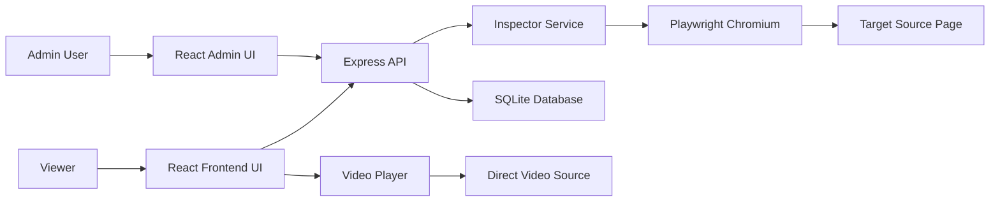
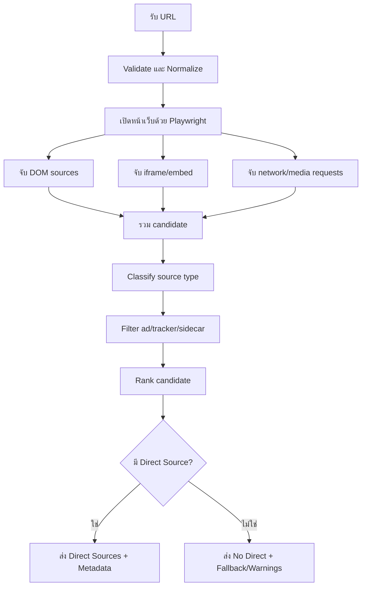

# Software Requirements Specification (SRS)

โปรเจกต์: Site Source Inspector  
เวอร์ชันเอกสาร: 1.1
วันที่จัดทำ: 2026-06-13  
สถานะ: Draft สำหรับวิเคราะห์ ออกแบบ และส่งต่อทีมพัฒนา
อัปเดตล่าสุด: เพิ่ม requirement สำหรับหน้า listing/detail แบบเว็บหนัง, advertising slots, related content, ซีรีส์, การ์ตูน, Netflix-like frontend และ mobile support

## 1. บทนำ

### 1.1 วัตถุประสงค์ของเอกสาร

เอกสารนี้ใช้กำหนดความต้องการของระบบ Site Source Inspector อย่างเป็นระบบ เพื่อให้ทีมพัฒนาหรือผู้รับงานต่อเข้าใจตรงกันว่าโปรเจกต์ต้องทำอะไร ทำอย่างไร ขอบเขตอยู่ตรงไหน และข้อจำกัดของระบบมีอะไรบ้าง

เอกสารนี้ครอบคลุมทั้งระบบหลังบ้านสำหรับนำเข้า ตรวจสอบ แก้ไข และจัดการข้อมูลวิดีโอ รวมถึงระบบหน้าบ้านสำหรับแสดงรายการหนังหรือวิดีโอในรูปแบบคล้าย Netflix และเล่นวิดีโอจาก Direct Video Source ที่ระบบบันทึกไว้

### 1.2 เป้าหมายของผลิตภัณฑ์

Site Source Inspector เป็นเว็บแอปสำหรับช่วยผู้ดูแลระบบนำ URL ของหน้ารายละเอียดวิดีโอหรือหนังมาวาง แล้วให้ระบบตรวจสอบหาแหล่งวิดีโอที่เล่นได้จริงโดยอัตโนมัติ พร้อมดึง metadata สำคัญ เช่น ชื่อเรื่อง รูป thumbnail คำอธิบาย หมวดหมู่ และ source type จากนั้นให้ผู้ดูแลยืนยันก่อนบันทึกลงฐานข้อมูล

ข้อมูลที่บันทึกแล้วจะถูกนำไปแสดงในหน้าบ้านเป็นเว็บไซต์ดูวิดีโอ/หนัง มีหน้าเลือกดูตามหมวดหมู่ ค้นหา รายละเอียด และหน้า player สำหรับเล่นวิดีโอ

### 1.3 ขอบเขตการใช้งานที่อนุญาต

ระบบนี้ควรใช้กับวิดีโอหรือเนื้อหาที่ผู้ใช้งานมีสิทธิ์จัดเก็บ เผยแพร่ หรือบริหารจัดการเท่านั้น ระบบไม่ควรถูกออกแบบเพื่อหลบเลี่ยง DRM, paywall, ระบบจำกัดสิทธิ์, token ที่ตั้งใจป้องกันการเข้าถึง หรือกลไกป้องกันลิขสิทธิ์ของบุคคลที่สาม

### 1.4 คำจำกัดความ

| คำ | ความหมาย |
| --- | --- |
| Direct Video Source | URL ที่สามารถนำไปให้ player เล่นวิดีโอได้โดยตรง เช่น `.m3u8`, `.mp4`, `.mpd` |
| HLS | HTTP Live Streaming มักใช้ไฟล์ master playlist หรือ media playlist นามสกุล `.m3u8` |
| DASH | MPEG-DASH มักใช้ไฟล์ manifest นามสกุล `.mpd` |
| Fallback Embed | iframe หรือ embed player จากเว็บอื่น เช่น YouTube หรือ player บุคคลที่สาม ไม่ใช่ direct video source |
| Sidecar Playlist | playlist ย่อย เช่น audio-only, subtitle, segment-list หรือ child playlist ที่ไม่เหมาะบันทึกเป็น source หลัก |
| Inspector | กระบวนการเปิด URL ด้วย browser automation แล้วจับ DOM, iframe, network request และ media request เพื่อหา source |
| Admin | ผู้ดูแลระบบที่นำเข้า ตรวจสอบ แก้ไข ลบ และบันทึกวิดีโอ |
| Frontend | เว็บไซต์ฝั่งผู้ชม ใช้แสดงรายการวิดีโอและ player |

## 2. ภาพรวมระบบ

### 2.1 สถานะระบบปัจจุบัน

โปรเจกต์ปัจจุบันเป็นเว็บแอป Node.js/TypeScript ใช้ Express เป็น backend, Playwright สำหรับ inspect URL, SQLite สำหรับเก็บข้อมูล และ React + Vite สำหรับ frontend/admin UI

ระบบมีหน้าใช้งานหลักดังนี้

| หน้า | URL | จุดประสงค์ |
| --- | --- | --- |
| Admin | `/admin` | นำเข้า URL, inspect, preview, save, edit, delete, search, filter |
| Frontend Catalog | `/` | แสดงรายการวิดีโอแบบหน้าเว็บดูหนัง |
| Watch Page | `/watch/:id` | เล่นวิดีโอและแสดงรายละเอียด |

### 2.2 Architecture ระดับสูง



### 2.3 แนวคิดการทำงานหลัก

1. Admin วาง URL ของหน้ารายละเอียดหนังหรือวิดีโอ
2. Admin กดปุ่มตรวจสอบ
3. Backend ใช้ Playwright เปิดหน้าเว็บนั้นแบบ browser จริง
4. Inspector ดึง metadata จาก HTML และจับ network/media request
5. ระบบแยกผลลัพธ์เป็น Direct Video Source, fallback embed, trailer, ad/tracker หรือ media ที่ไม่ควรใช้
6. ถ้าเจอ Direct Video Source ที่เหมาะสม ระบบให้ preview และให้ admin ยืนยันก่อนบันทึก
7. ถ้าไม่เจอ Direct Video Source ระบบต้องแจ้งชัดเจน และไม่ควรให้บันทึก source ที่เป็น fallback/ad โดยไม่ได้ตั้งใจ
8. วิดีโอที่บันทึกแล้วจะแสดงใน frontend และเล่นผ่าน player

## 3. ผู้ใช้งานและ Use Case

### 3.1 ประเภทผู้ใช้งาน

| ผู้ใช้งาน | ความต้องการ |
| --- | --- |
| Admin | นำเข้าหนังทีละเรื่อง ตรวจสอบ source แก้ไขข้อมูล ลบข้อมูล จัดหมวดหมู่ และดูสถานะว่าข้อมูลพร้อมเผยแพร่หรือไม่ |
| Viewer | ค้นหา เลือกหมวดหมู่ เปิดรายละเอียด และดูวิดีโอผ่าน player ที่ใช้งานง่าย |
| Developer | เพิ่ม adapter สำหรับเว็บใหม่ แก้ logic คัดกรอง source ปรับ UI และดูแล API/DB |

### 3.2 Use Case หลักของ Admin

#### UC-A01: ตรวจสอบ URL หนังหนึ่งเรื่อง

เป้าหมาย: หา Direct Video Source และ metadata จาก URL ที่วาง

Flow:

1. Admin เปิดหน้า `/admin`
2. วาง URL ในช่องนำเข้า
3. กดปุ่ม "ตรวจสอบ"
4. ระบบแสดง progress ระหว่าง inspect
5. ระบบแสดงผลลัพธ์ source ที่พบ
6. ระบบเติมข้อมูล metadata ลงฟอร์ม
7. Admin ตรวจสอบ preview
8. Admin เลือกประเภทหนัง/หมวดหมู่
9. Admin กดบันทึก
10. ระบบบันทึกข้อมูลลง database และเคลียร์ฟอร์มนำเข้า

#### UC-A02: กรณีไม่เจอ Direct Video Source

เป้าหมาย: ป้องกันการบันทึกข้อมูลผิด เช่น iframe โฆษณา trailer หรือ fallback embed

Flow:

1. Admin วาง URL และกดตรวจสอบ
2. ระบบ inspect แล้วไม่พบ Direct Video Source
3. ระบบแสดงข้อความชัดเจนว่าไม่พบ Direct Video Source
4. ถ้าพบ fallback embed ให้แสดงแยกต่างหากพร้อมคำเตือน
5. ระบบไม่ auto-preview fallback ที่อาจมีโฆษณา
6. ระบบไม่ควรเปิดให้บันทึกเป็นวิดีโอหลักโดยไม่ได้ยืนยันแบบชัดเจน

#### UC-A03: แก้ไขข้อมูลวิดีโอเดิม

เป้าหมาย: ให้ admin แก้ metadata, category, thumbnail, source และ source type ได้

Flow:

1. Admin ค้นหาวิดีโอใน Library
2. กด "แก้ไข"
3. ระบบโหลดข้อมูลเดิมขึ้นฟอร์ม
4. Admin แก้ข้อมูล
5. Admin กดบันทึก
6. ระบบอัปเดตข้อมูลและแสดงแจ้งเตือนในตำแหน่งที่มองเห็นง่าย

#### UC-A04: ลบวิดีโอ

เป้าหมาย: ลบข้อมูลที่ไม่ต้องการออกจากระบบ

Flow:

1. Admin กด "ลบ" จาก Library
2. ระบบถามยืนยัน
3. Admin ยืนยัน
4. ระบบลบข้อมูลจาก database
5. Library refresh และแสดงแจ้งเตือน

### 3.3 Use Case หลักของ Viewer

#### UC-F01: เลือกดูวิดีโอจากหน้าบ้าน

1. Viewer เปิด `/`
2. เห็น hero section และรายการวิดีโอ
3. เลือกหมวดหมู่หรือค้นหา
4. กด poster/title เพื่อเข้า watch page

#### UC-F02: เล่นวิดีโอ

1. Viewer เปิด `/watch/:id`
2. ระบบโหลด metadata และ source
3. Player เริ่มพร้อมเล่น
4. ถ้า source เล่นไม่ได้ ระบบแสดง error ที่เข้าใจง่าย

## 4. Functional Requirements

### 4.1 Admin Import และ Inspect

| ID | Requirement | Priority |
| --- | --- | --- |
| FR-A01 | ระบบต้องมีช่องวาง URL สำหรับตรวจสอบหนังทีละเรื่อง | Must |
| FR-A02 | ระบบต้องไม่เริ่ม inspect ทันทีหลังวาง URL ต้องรอให้กดปุ่มตรวจสอบก่อน | Must |
| FR-A03 | ระบบต้อง validate URL เบื้องต้นก่อนส่งเข้า backend | Must |
| FR-A04 | ระบบต้องแสดง progress หรือสถานะระหว่าง inspect ให้ชัดเจน | Must |
| FR-A05 | ระบบต้องแสดงผล Direct Video Source แยกจาก fallback embed/trailer/ad | Must |
| FR-A06 | ระบบต้องไม่นำ fallback embed หรือ ad มาเป็น direct source โดยอัตโนมัติ | Must |
| FR-A07 | ระบบต้องเติม title, thumbnail, description, page URL และ source type ลงฟอร์มเมื่อพบข้อมูล | Must |
| FR-A08 | ระบบต้องรองรับกรณีเจอ source มากกว่า 1 รายการ โดยให้ admin เลือกรายการที่จะใช้ | Must |
| FR-A09 | ระบบต้องแสดงข้อความชัดเจนเมื่อไม่พบ Direct Video Source | Must |
| FR-A10 | ระบบต้องแสดง fallback embed เฉพาะในส่วนคำเตือน ไม่ปะปนกับ source หลัก | Should |
| FR-A11 | ระบบต้องรองรับการวาง URL หน้าหมวดหมู่ที่มี card หนัง เพื่อดึงลิงก์หน้าหนังย่อยทั้งหมดในหน้านั้น | Must |
| FR-A12 | Batch import ต้องแสดงรายการ card ที่พบ ให้ admin เลือก/ยกเลิกเลือกก่อนเริ่ม inspect | Must |
| FR-A13 | Batch inspect ต้องแสดง progress ตามจำนวนรายการที่ตรวจสอบแล้ว และแยกสถานะพร้อมบันทึก/ต้องตรวจเอง/ผิดพลาด | Must |
| FR-A14 | Batch save ต้องบันทึกเฉพาะรายการที่เจอ direct source พร้อมใช้งาน และไม่บันทึก fallback embed หรือโฆษณา | Must |
| FR-A15 | Category card discovery ต้อง scroll/load lazy content ก่อน extract เพื่อให้ได้ card จากทั้งหน้าเท่าที่เว็บโหลดได้ | Must |
| FR-A16 | Batch save ต้องตรวจ source health ผ่าน playback/proxy path ก่อนบันทึก และรายการที่ fail ต้องถูกกันไว้ในสถานะผิดพลาด | Must |
| FR-A17 | Batch movie import ต้องตรวจว่า URL นั้นเป็นซีรีส์หรือหลายตอนหรือไม่ ถ้าพบหลายตอนต้องไม่บันทึกเป็นหนังเดี่ยว และต้องแจ้งให้ไปจัดการในหน้าแอดมินซีรีส์หรือ workflow ซีรีส์ | Must |

### 4.2 Source Detection และ Filtering

| ID | Requirement | Priority |
| --- | --- | --- |
| FR-S01 | Inspector ต้องจับ network request ที่เป็น `.m3u8`, `.mp4`, `.mpd` | Must |
| FR-S02 | Inspector ต้องจับ `<video>`, `<source>`, iframe, embed และ script-related candidate เท่าที่ทำได้ | Must |
| FR-S03 | Inspector ต้อง classify source type เช่น `hls`, `mp4`, `dash`, `embed` | Must |
| FR-S04 | Inspector ต้องกรอง ad/tracker/media false positive ออกจาก direct source | Must |
| FR-S05 | Inspector ต้องพยายามเลือก HLS master playlist มากกว่า child playlist หรือ segment URL | Must |
| FR-S06 | Inspector ต้องแยก trailer เช่น YouTube ออกจาก source หลัก | Must |
| FR-S07 | Inspector ต้องส่ง fallback embed กลับมาได้เพื่อ debug แต่ต้อง flag ว่าไม่ใช่ direct source | Should |
| FR-S08 | ระบบควรออกแบบให้เพิ่ม site-specific adapter ได้ในอนาคต | Must |

### 4.3 Metadata Extraction

| ID | Requirement | Priority |
| --- | --- | --- |
| FR-M01 | ระบบต้องดึง title จาก meta tag, OpenGraph, document title หรือ selector ที่เหมาะสม | Must |
| FR-M02 | ระบบต้องดึง thumbnail จาก `og:image`, schema, poster หรือ image หลักของหน้า | Must |
| FR-M03 | ระบบต้องดึง description จาก `og:description`, meta description หรือเนื้อหาหน้า | Must |
| FR-M04 | ระบบต้องแสดง preview รูป thumbnail ทั้งฝั่ง admin และ frontend | Must |
| FR-M05 | ระบบต้องให้ admin แก้ metadata เองก่อนบันทึก | Must |
| FR-M06 | ระบบควรทำ image fallback ถ้ารูปโหลดไม่ได้ | Should |
| FR-M07 | ระบบต้องดึงหมวดหมู่จากหน้ารายละเอียดหนัง เช่น breadcrumb/category links และใช้กับ batch import ก่อน fallback เดาจากชื่อเรื่อง | Must |

### 4.4 Save, Edit, Delete

| ID | Requirement | Priority |
| --- | --- | --- |
| FR-D01 | ระบบต้องบันทึกวิดีโอลง database หลัง admin ยืนยันเท่านั้น | Must |
| FR-D02 | ระบบต้องให้เลือกประเภทหนัง/หมวดหมู่ก่อนหรือระหว่างบันทึก | Must |
| FR-D03 | ระบบต้องแก้ไขข้อมูลเดิมได้ | Must |
| FR-D04 | ระบบต้องลบข้อมูลเดิมได้ | Must |
| FR-D05 | ระบบต้องเคลียร์ช่อง URL และฟอร์มที่เกี่ยวข้องหลังบันทึกสำเร็จสำหรับรายการใหม่ | Must |
| FR-D06 | ระบบต้องแสดงแจ้งเตือน save/update/delete ในตำแหน่งที่มองเห็นง่าย ไม่อยู่ท้ายจอ | Must |
| FR-D07 | ระบบต้องป้องกันการบันทึก source ที่เป็น ad/tracker หรือ fallback โดยไม่ตั้งใจ | Must |

### 4.5 Admin Library

| ID | Requirement | Priority |
| --- | --- | --- |
| FR-L01 | ระบบต้องแสดงรายการวิดีโอที่บันทึกแล้วในหน้า admin | Must |
| FR-L02 | ระบบต้องรองรับข้อมูลจำนวนหลักร้อยขึ้นไปด้วย pagination หรือ virtualized list | Must |
| FR-L03 | ระบบต้องค้นหาจาก title, description และ page URL ได้ | Must |
| FR-L04 | ระบบต้องกรองตาม category ได้ | Must |
| FR-L05 | ระบบต้องแสดง thumbnail, title, category, source type และ actions | Must |
| FR-L06 | Frontend ต้องแยก content type ชัดเจนระหว่างหนังเดี่ยวและซีรีส์ ไม่แสดงซีรีส์หลายตอนปนเป็นหนังเดี่ยวในหน้า watch movie | Must |
| FR-L07 | หน้า frontend ต้องมีเมนูหลักอย่างน้อย `หนัง`, `ซีรีส์`, และ `หมวดหมู่` เพื่อให้ผู้ใช้เข้าใจโครงสร้างเว็บ | Must |
| FR-L08 | ซีรีส์ต้องมีหน้า detail/watch ของตัวเองที่แสดงรายการตอนทั้งหมดและให้เลือกเล่นแต่ละตอนได้ | Must |
| FR-L09 | ระบบต้อง responsive ใช้งานบน desktop, tablet และ mobile ได้ | Must |

### 4.5.1 Google Sheets Export

| ID | Requirement | Priority |
| --- | --- | --- |
| FR-GS01 | ระบบต้องใช้ database เป็นแหล่งข้อมูลหลัก และใช้ Google Sheets เป็นช่องทาง export/sync สำรองเท่านั้น | Must |
| FR-GS02 | Admin ต้องกดส่งออกข้อมูลไป Google Sheets เองได้จากหน้าแอดมินหนังเดี่ยวและซีรีส์ | Must |
| FR-GS03 | การส่งออกต้องแยกแท็บข้อมูลอย่างน้อย `Videos`, `Series`, `Episodes`, และ `Categories` เพื่อให้ตรวจสอบหรือส่งต่อทีมงานได้ง่าย | Must |
| FR-GS04 | ถ้ายังไม่ได้ตั้งค่า Google Sheet credential ระบบต้องแจ้งเตือนชัดเจนและไม่กระทบการบันทึกลง database | Must |
| FR-GS05 | Local development ต้องอ่าน `ServiceAccountKey.json` ใน project root ได้โดยตรงเมื่อไม่มี env credential และ production ต้องใช้ env credential แทนการ commit key | Must |
| FR-GS06 | การส่งออกต้อง overwrite snapshot ล่าสุดของแต่ละแท็บ เพื่อลดข้อมูลซ้ำและทำให้ Sheet ตรงกับ database ปัจจุบัน | Should |
| FR-GS07 | ระบบต้องใช้ Sheet ID `1tmUDB4qbO9gmhCqo2E-djnNydwqmm6nrHGSQz93kpp0` เป็นค่าเริ่มต้นถ้าไม่มี `GOOGLE_SHEET_ID` | Must |
| FR-GS08 | Export ต้องสร้างแท็บและ header columns ให้อัตโนมัติ รวมถึง `AdminUsers` และ `Ads` สำหรับ config เพิ่มในอนาคต | Must |

### 4.5.2 Admin Login

| ID | Requirement | Priority |
| --- | --- | --- |
| FR-AUTH01 | หน้า `/admin` และ `/admin/series` ต้องมีระบบ login ก่อนใช้งาน | Must |
| FR-AUTH02 | ค่าเริ่มต้นต้องมี user `rpumpo` และ password `Z24312433z` สำหรับ development bootstrap | Must |
| FR-AUTH03 | ระบบต้องรองรับการอ่าน admin users จาก Google Sheet แท็บ `AdminUsers` เมื่อมี credential | Should |
| FR-AUTH04 | Admin APIs ที่ inspect/export/create/update/delete ต้องถูกป้องกันด้วย session cookie | Must |

### 4.6 Frontend Catalog

| ID | Requirement | Priority |
| --- | --- | --- |
| FR-F01 | หน้าบ้านต้องแสดงรายการวิดีโอจาก database | Must |
| FR-F02 | หน้าบ้านต้องมีหมวดหมู่หนังให้เลือก | Must |
| FR-F03 | หน้าบ้านต้องมี search | Should |
| FR-F04 | หน้าบ้านควรมี layout คล้าย Netflix เช่น hero, rail, poster grid | Should |
| FR-F05 | หน้าบ้านต้องแสดง thumbnail ถูกต้อง | Must |
| FR-F06 | กดรายการวิดีโอแล้วต้องไปหน้า watch ได้ | Must |

### 4.7 Watch Page และ Player

| ID | Requirement | Priority |
| --- | --- | --- |
| FR-P01 | Watch page ต้องโหลดข้อมูลวิดีโอจาก API ตาม id | Must |
| FR-P02 | Player ต้องรองรับ HLS `.m3u8` | Must |
| FR-P03 | Player ต้องรองรับ MP4 direct file | Must |
| FR-P04 | Player ควรรองรับ DASH `.mpd` หากเพิ่ม library ที่เหมาะสม | Should |
| FR-P05 | Player ต้องแสดง error เมื่อเล่นไม่ได้ | Must |
| FR-P06 | Player ควรใช้ library ที่ production-friendly เช่น hls.js, Shaka Player, Video.js หรือ JW Player ตามงบและ license | Should |
| FR-P07 | Watch page ต้องจัด layout แบบเว็บหนัง มีตำแหน่งโฆษณาด้านบน/ข้าง/ก่อน player และยัง responsive บนมือถือ | Must |
| FR-P08 | Watch page ต้องลดโอกาสการคัดลอก source URL ด้วยการไม่ render URL ใน DOM, ปิด context menu บน player, และซ่อน endpoint ผ่าน player component เท่าที่เว็บทำได้ | Should |
| FR-P09 | การรองรับ LINE LIFF ถูกพักไว้ก่อน ระบบหน้าบ้านต้องใช้งานผ่าน browser ปกติได้โดยไม่ต้อง login LINE | Should |
| FR-P10 | Playback proxy ต้องรองรับ HLS master/media playlists, nested playlist, segment, และ HLS URI attributes เช่น key/map เท่าที่จำเป็น | Must |
| FR-P11 | Player ต้องมีปุ่มเชื่อมต่อเพื่อดูบนทีวี โดยใช้ browser Remote Playback API เมื่ออุปกรณ์และ browser รองรับ | Should |
| FR-P12 | ปุ่มลูกศรของ poster rail ต้องแสดงเฉพาะเมื่อรายการล้นพื้นที่จริง ถ้าการ์ดแสดงครบในหน้าจอแล้วต้องไม่แสดงลูกศร | Must |

## 5. Non-Functional Requirements

### 5.1 Performance

| ID | Requirement |
| --- | --- |
| NFR-P01 | หน้า admin ต้องโหลดรายการวิดีโอแบบแบ่งหน้า ไม่โหลดทั้งหมดเมื่อข้อมูลมีจำนวนมาก |
| NFR-P02 | Inspect หนึ่ง URL ควรมี timeout ชัดเจน เช่น 30-60 วินาที |
| NFR-P03 | UI ต้องไม่ค้างระหว่าง inspect ต้องแสดงสถานะ loading/progress |
| NFR-P04 | Frontend catalog ต้อง render ได้ลื่นสำหรับข้อมูลหลักร้อยรายการ |

### 5.2 Reliability

| ID | Requirement |
| --- | --- |
| NFR-R01 | ถ้า inspect ล้มเหลว ระบบต้องคืน error ที่อ่านเข้าใจ ไม่ใช่ crash |
| NFR-R02 | ถ้า thumbnail โหลดไม่ได้ ต้องมี fallback visual |
| NFR-R03 | ถ้า video source เล่นไม่ได้ ต้องแสดงสถานะให้ viewer รู้ |
| NFR-R04 | Save/update/delete ต้อง refresh state ให้ตรงกับ database |

### 5.3 Security

| ID | Requirement |
| --- | --- |
| NFR-S01 | ระบบ admin ควรมี authentication ก่อนใช้งานจริง |
| NFR-S02 | API ต้อง validate input ทุก endpoint |
| NFR-S03 | URL inspect ควรมี SSRF protection เช่น block localhost/private network ใน production |
| NFR-S04 | ระบบไม่ควร expose stack trace หรือ internal error ให้ frontend |
| NFR-S05 | ถ้ามีการ proxy source ในอนาคต ต้องป้องกัน abuse และ bandwidth leak |

### 5.4 Maintainability

| ID | Requirement |
| --- | --- |
| NFR-M01 | Logic inspect ควรแยกเป็น module ชัดเจน และรองรับ adapter รายเว็บ |
| NFR-M02 | UI component ควรแยกตามหน้าที่ เช่น ImportPanel, PreviewPanel, MetadataForm, LibraryTable |
| NFR-M03 | ควรมี test สำหรับ inspector filtering และ API validation |
| NFR-M04 | เอกสาร setup, run, deploy และ troubleshooting ต้องอัปเดตตามระบบ |
| NFR-M05 | Production build ต้องมี `npm run build` สำหรับ hosting platform ที่เรียก build script มาตรฐาน เช่น Vercel |
| NFR-M06 | ถ้าต้องส่ง SQLite snapshot ไปกับ repository ต้อง track เฉพาะ `site-source-inspector.db` หลัง checkpoint แล้ว และไม่ track runtime WAL/SHM files |
| NFR-M07 | Vercel static deployment ต้องกำหนด output directory ให้ตรงกับ Vite output ปัจจุบันคือ `dist` และ rewrite SPA routes กลับเข้า `index.html` |
| NFR-M08 | Vercel deployment ต้องมี serverless API catch-all สำหรับ `/api/*` เพื่อไม่ให้ SPA rewrite ส่ง HTML กลับไปแทน JSON API |
| NFR-M09 | Frontend production ต้องมี static JSON fallback จาก SQLite snapshot เพื่อให้ catalog/watch metadata ยังแสดงได้เมื่อ serverless API ใช้งานไม่ได้ |
| NFR-M10 | Static production catalog ต้องใช้โปสเตอร์หนังจริงจาก metadata เป็นค่าแรกเสมอ และใช้ local generated poster เฉพาะเป็น fallback เมื่อรูปจริงโหลดไม่ได้เท่านั้น |
| NFR-M11 | Build pipeline ต้องพยายาม cache ไฟล์โปสเตอร์หนังจริงจาก remote thumbnail มาไว้ใต้ static assets ของเว็บเอง เพื่อลดปัญหา hotlink/DNS/CDN ที่ทำให้ production โหลดรูปไม่ขึ้น |
| NFR-M12 | LIFF/LINE login ถูกยกเลิกชั่วคราวตาม requirement ล่าสุด หน้าบ้านต้องเปิดตรงผ่าน browser ได้โดยไม่บังคับ LINE login |
| NFR-M13 | พื้นที่โฆษณาทุก slot ต้องแสดงขนาดแนะนำให้ผู้ลงโฆษณาเห็นชัดเจน |
| NFR-M14 | Mobile poster rails ต้องมีปุ่มลูกศรเลื่อนซ้าย/ขวาเมื่อรายการเกินความกว้างหน้าจอ |

### 5.5 Usability และ UX

| ID | Requirement |
| --- | --- |
| NFR-U01 | หน้า admin ต้องอ่านง่าย ใช้งานเร็ว และไม่รกตา |
| NFR-U02 | ปุ่มสำคัญ เช่น ตรวจสอบและบันทึก ต้องมีขนาดและตำแหน่งเด่น |
| NFR-U03 | ข้อความแจ้งเตือนต้องอยู่ใกล้บริบทของ action หรือในตำแหน่งที่เห็นทันที |
| NFR-U04 | UI ต้องเป็นภาษาไทยในส่วนที่ admin ใช้งาน |
| NFR-U05 | Responsive ต้องใช้งานได้จริง ไม่ใช่แค่ย่อขนาด |

## 6. Data Requirements

### 6.1 Entity: Video

| Field | Type | Required | Description |
| --- | --- | --- | --- |
| id | integer | Yes | Primary key |
| title | text | Yes | ชื่อวิดีโอ/หนัง |
| description | text | No | คำอธิบาย |
| thumbnail | text | No | URL รูป poster/thumbnail |
| sourceUrl | text | Yes | Direct Video Source ที่เล่นได้ |
| sourceType | text | Yes | `hls`, `mp4`, `dash`, `embed` |
| pageUrl | text | No | URL ต้นทางที่ inspect |
| category | text | No | หมวดหมู่ เช่น Action, Drama, Comedy |
| createdAt | datetime | Yes | วันที่สร้าง |
| updatedAt | datetime | Yes | วันที่แก้ไขล่าสุด |

### 6.2 Category

ปัจจุบัน category อาจมาจากค่าที่บันทึกในตาราง videos โดยตรง ยังไม่มีตาราง category แยก หากระบบใหญ่ขึ้นควรแยกเป็นตาราง categories เพื่อควบคุมชื่อหมวดหมู่ slug ลำดับแสดงผล และสถานะเปิด/ปิด

### 6.3 ข้อควรพิจารณาเมื่อ scale

| ประเด็น | แนวทาง |
| --- | --- |
| ข้อมูลเพิ่มเป็นหลักพัน | เพิ่ม index ที่ title, category, createdAt |
| ต้องมีหลาย admin | เพิ่ม users, roles, audit_logs |
| ต้องมีหลาย source ต่อเรื่อง | เพิ่ม video_sources แยกจาก videos |
| ต้องมีตอน/ซีรีส์ | เพิ่ม series, seasons, episodes |
| ต้องจัดหน้า landing เอง | เพิ่ม collections, banners, featured rows |

## 7. API Requirements

### 7.1 Admin Inspect

Endpoint: `POST /api/admin/inspect`

Request:

```json
{
  "url": "https://example.com/movie-page/"
}
```

Response สำเร็จ:

```json
{
  "metadata": {
    "title": "Movie Title",
    "description": "Description",
    "thumbnail": "https://example.com/poster.jpg",
    "pageUrl": "https://example.com/movie-page/"
  },
  "sources": [
    {
      "url": "https://cdn.example.com/movie/playlist.m3u8",
      "type": "hls",
      "label": "video / xhr",
      "isDirect": true
    }
  ],
  "fallbackEmbeds": [
    {
      "url": "https://third-party.example.com/embed?id=123",
      "type": "embed",
      "label": "iframe embed",
      "isDirect": false
    }
  ],
  "warnings": []
}
```

Response เมื่อไม่พบ source:

```json
{
  "metadata": {
    "title": "Movie Title",
    "description": "",
    "thumbnail": ""
  },
  "sources": [],
  "fallbackEmbeds": [],
  "warnings": [
    "ไม่พบ Direct Video Source"
  ]
}
```

### 7.2 Videos

#### GET `/api/videos`

Query:

| Parameter | Description |
| --- | --- |
| page | หน้าปัจจุบัน |
| pageSize | จำนวนรายการต่อหน้า |
| search | คำค้น |
| category | หมวดหมู่ |

Response:

```json
{
  "videos": [],
  "total": 0,
  "page": 1,
  "pageSize": 20,
  "categories": []
}
```

#### GET `/api/videos/:id`

ดึงข้อมูลวิดีโอตาม id

#### POST `/api/videos`

สร้างวิดีโอใหม่

#### PUT `/api/videos/:id`

แก้ไขข้อมูลวิดีโอ

#### DELETE `/api/videos/:id`

ลบวิดีโอ

## 8. Inspector Design

### 8.1 Source Inspection Pipeline



### 8.2 Candidate Sources

ระบบควรมองหา source จากตำแหน่งต่อไปนี้

| แหล่ง | ตัวอย่าง |
| --- | --- |
| Network request | `.m3u8`, `.mp4`, `.mpd`, media response |
| DOM video | `<video src>`, `<source src>` |
| Inline script | URL ที่ฝังอยู่ใน JS config |
| iframe | player embed |
| OpenGraph/video meta | `og:video`, `twitter:player` |

### 8.3 Direct Source Ranking

ลำดับความน่าเชื่อถือที่ควรใช้:

1. HLS master playlist ที่มี variant หลาย resolution
2. MP4 direct file ที่เล่นได้
3. DASH manifest
4. HLS media playlist ที่ไม่ใช่ audio-only/segment-only
5. Embed fallback เฉพาะกรณี admin เลือกเองและระบบอนุญาต

### 8.4 Rejection Rules

ระบบควร reject source ประเภทต่อไปนี้จาก direct source หลัก:

| ประเภท | เหตุผล |
| --- | --- |
| ad media | เป็นโฆษณา ไม่ใช่หนัง |
| tracker/pixel | ไม่ใช่วิดีโอ |
| trailer | ไม่ใช่ตัวหนังหลัก |
| iframe embed | เป็น player บุคคลที่สาม ไม่ใช่ direct video |
| `.bin` fragment | มักเป็น segment ภายใน ไม่ใช่ source หลัก |
| audio-only playlist | ไม่มีภาพ |
| subtitle/caption | ไม่ใช่วิดีโอ |

### 8.5 Site-Specific Adapter

ควรออกแบบ adapter เพิ่มสำหรับเว็บที่มีโครงสร้างเฉพาะ เช่น player ซ้อน iframe, config encode, source อยู่หลัง API หรือมีการเลือก server ภายในหน้า

โครงสร้างที่แนะนำ:

```text
src/inspectors/
  core.ts
  adapters/
    generic.ts
    zmdb.ts
    ebullio.ts
    nunghd4k.ts
  filters.ts
  ranking.ts
  metadata.ts
```

Adapter แต่ละตัวควรมีหน้าที่:

1. ตรวจว่า URL หรือ iframe ตรงกับ domain ที่รองรับหรือไม่
2. เปิดหน้า/player ตามขั้นตอนเฉพาะ
3. trigger action ที่จำเป็น เช่น กด play หรือเลือก server ถ้าถูกต้องตามขอบเขตการใช้งาน
4. คืน candidate source ให้ core pipeline

## 9. UI/UX Requirements

### 9.1 Admin Page Design Principles

หน้า admin ต้องเน้นทำงานเร็ว ไม่รก และใช้กับรายการจำนวนมากได้

หลักการ:

1. แบ่ง flow เป็นขั้นตอนชัดเจน: นำเข้า -> ตรวจสอบ -> ตรวจผล -> กรอก/แก้ไขข้อมูล -> บันทึก
2. ปุ่มสำคัญต้องใหญ่และอยู่ใกล้จุดที่ผู้ใช้ตัดสินใจ
3. Source result ต้องแยก direct/fallback/warning ให้ไม่สับสน
4. Preview ต้องไม่กินพื้นที่เกินจำเป็นบนจอเล็ก
5. Library ต้องค้นหาและกรองได้รวดเร็ว
6. แจ้งเตือนต้องอยู่ใกล้บริบท เช่น กล่องบันทึก ไม่ใช่ท้ายจอ
7. UI admin ต้องเป็นภาษาไทยทั้งหมด

### 9.2 Admin Layout ที่แนะนำ

Desktop:

```text
+-------------------------------------------------------------+
| Header: Admin / View site / Stats                            |
+-------------------------------+-----------------------------+
| Import + Inspect              | Preview Player              |
| Source Results                | Source Status               |
+-------------------------------+-----------------------------+
| Metadata + Save Panel                                       |
+-------------------------------------------------------------+
| Library Search / Filters                                    |
| Paginated Table                                             |
+-------------------------------------------------------------+
```

Mobile:

```text
Header
Import + Inspect
Source Results
Preview
Metadata + Save
Library Search
Library Cards
```

### 9.3 Save UX

หลังบันทึกสำเร็จ:

1. แสดง success notice ใกล้ปุ่มบันทึก
2. เคลียร์ช่อง URL import
3. เคลียร์ source result ถ้าเป็น create ใหม่
4. reset form เป็นสถานะพร้อมเพิ่มรายการใหม่
5. refresh library

กรณีแก้ไข:

1. แสดง update success
2. คง context ของรายการที่แก้ไขจนกว่า admin กด "รายการใหม่"
3. refresh library

### 9.4 Frontend Design Principles

หน้าบ้านควรมีความรู้สึกคล้ายบริการ streaming:

1. ภาพ thumbnail/poster ต้องเด่นและโหลดถูกต้อง
2. หมวดหมู่ต้องเข้าถึงง่าย
3. Search ต้องใช้งานเร็ว
4. Hero ควรใช้ข้อมูลจากวิดีโอล่าสุดหรือวิดีโอเด่น
5. Watch page ต้องเน้น player เป็นหลัก
6. หาก source เล่นไม่ได้ ต้องมีข้อความแจ้ง ไม่ปล่อยให้ player ว่างเปล่า

## 10. Player Strategy

### 10.1 ตัวเลือก Player

| Player | เหมาะกับ | หมายเหตุ |
| --- | --- | --- |
| Native `<video>` + hls.js | ระบบเบา ควบคุมเองง่าย | เหมาะกับ HLS/MP4 ทั่วไป |
| Video.js | ต้องการ UI และ plugin ecosystem | ใช้ง่ายใน production |
| Shaka Player | ต้องการ DASH/HLS และ feature ขั้นสูง | เหมาะกับ manifest หลายแบบ |
| JW Player | ต้องการ player commercial สำเร็จรูป | ต้องตรวจ license และค่าใช้จ่าย |

คำแนะนำระยะต้น: ใช้ native `<video>` + hls.js สำหรับ HLS/MP4 ก่อน เพราะเบาและควบคุมง่าย หากต่อไปต้องรองรับ DASH, DRM แบบถูกลิขสิทธิ์ หรือ analytics player ขั้นสูง ค่อยพิจารณา Shaka หรือ JW Player

### 10.2 Playback Requirements

1. HLS ต้องเล่นได้บน Chrome/Edge ผ่าน hls.js
2. Safari อาจเล่น HLS native ได้
3. MP4 เล่นผ่าน native video
4. ต้อง handle CORS error
5. ต้องแสดง error เมื่อ source ไม่สามารถเล่นได้

## 11. Testing Strategy

### 11.1 Unit Tests

ควรมี test สำหรับ:

1. URL classification
2. ad/tracker filtering
3. source ranking
4. metadata extraction fallback
5. API validation

### 11.2 Integration Tests

ควรทดสอบ:

1. `POST /api/admin/inspect` กับ URL ที่คาดว่าจะเจอ direct HLS
2. `POST /api/admin/inspect` กับ URL ที่มีเฉพาะ fallback embed
3. Create/update/delete video
4. Pagination/search/category filter
5. Category card discovery จาก `https://www.24hd.net/category/หนังใหม่2026/` ต้องเจอลิงก์ card หนังหลัก ไม่ใช่เมนูหรือ sidebar

### 11.3 UI Tests

ควรใช้ Playwright ตรวจ:

1. หน้า admin desktop
2. หน้า admin mobile
3. import -> inspect -> save flow
4. edit/delete flow
5. frontend thumbnail preview
6. watch page player state

### 11.4 Regression Cases ที่ควรเก็บไว้

| URL | Expected Result |
| --- | --- |
| `https://www.ebullio.co.uk/เซต้า-ปริศนาจารชน/` | พบ direct HLS `.m3u8` |
| `https://www.nunghd4k.com/the-punisher-one-last-kill-2026/` | ไม่ควรบันทึก YouTube trailer เป็นหนังหลัก |
| `https://25-hd.com/mortal-kombat-ii-2026/` | ถ้ายังไม่มี adapter เฉพาะ ให้แสดง fallback/embed ชัดเจน ไม่ปนกับ direct source |
| `https://www.24hd.net/the-evil-lawyer-2026` | ต้องดึง metadata ได้ พบ HLS หลัก `media.vdohls.com/.../playlist.m3u8` โดยไม่ปน MP4 โฆษณา และต้องแตก episode draft ได้ 8 ตอน |

## 12. Current Known Limitations

| ข้อจำกัด | ผลกระทบ |
| --- | --- |
| ยังไม่มีระบบ login admin | ไม่เหมาะสำหรับ production public |
| ยังไม่มี adapter รายเว็บครบ | บางเว็บอาจเจอแค่ fallback embed |
| SQLite local file | เหมาะกับระบบเล็กถึงกลาง ยังไม่เหมาะกับ multi-instance |
| ยังไม่มี queue/background job | Inspect หลายรายการพร้อมกันยังไม่เหมาะ |
| ยังไม่มี source health check | Source ที่เคยบันทึกอาจหมดอายุได้ |
| ยังไม่มี audit log | ไม่รู้ว่าใครแก้อะไรเมื่อไร |
| ยังไม่มี image proxy/optimizer | thumbnail จากบางเว็บอาจ hotlink ไม่ได้ |
| ยังไม่มี deploy config production | ต้องออกแบบ environment และ hosting เพิ่ม |

## 13. Roadmap ที่แนะนำ

### Phase 1: Stabilize Current System

1. ทำ SRS และ README ให้ครบ
2. แยก inspector core/filter/ranking ให้ดูแลได้ง่าย
3. เพิ่ม test ให้ source filtering
4. ปรับ admin UX ให้จบและ responsive จริง
5. ตรวจ frontend thumbnail/player ให้เสถียร

### Phase 2: Site Adapter System

1. เพิ่ม adapter interface
2. ทำ generic adapter
3. ทำ adapter สำหรับเว็บที่ใช้งานจริงทีละเว็บ
4. เก็บ regression fixtures ของแต่ละเว็บ
5. เพิ่ม debug log สำหรับ inspect result

### Phase 3: Production Readiness

1. เพิ่ม admin authentication
2. เพิ่ม role และ audit log
3. เพิ่ม source health check
4. เพิ่ม backup database
5. เพิ่ม deployment config
6. เพิ่ม monitoring/logging

### Phase 4: Content Management Expansion

1. เพิ่ม categories table
2. เพิ่ม featured collections
3. เพิ่ม series/seasons/episodes
4. เพิ่ม bulk import แบบ queue ถ้าจำเป็น
5. เพิ่ม dashboard สถานะ source

## 14. Acceptance Criteria

### 14.1 Admin

ระบบจะถือว่าผ่านเมื่อ:

1. Admin วาง URL แล้วระบบไม่ inspect จนกว่าจะกดปุ่ม
2. ระหว่าง inspect มี progress/status ชัดเจน
3. Direct Video Source แสดงแยกจาก fallback embed
4. ถ้าไม่พบ direct source ระบบแจ้งชัดและไม่ save มั่ว
5. Save สำเร็จแล้วเคลียร์ฟอร์มสำหรับรายการใหม่
6. Edit/delete ใช้งานได้จริง
7. Library รองรับข้อมูลจำนวนมากด้วย search/filter/pagination
8. หน้า admin responsive ใช้งานได้บน mobile

### 14.2 Frontend

ระบบจะถือว่าผ่านเมื่อ:

1. หน้าแรกแสดงวิดีโอจาก database
2. Thumbnail แสดงถูกต้อง
3. Category filter ทำงาน
4. Search ทำงาน
5. กดวิดีโอแล้วเข้า watch page ได้
6. Watch page เล่น HLS/MP4 ได้
7. ถ้า source เล่นไม่ได้ แสดง error ชัดเจน

### 14.3 Inspector

ระบบจะถือว่าผ่านเมื่อ:

1. URL ที่มี direct HLS ต้องตรวจพบได้
2. URL ที่มีแต่ trailer ต้องไม่ถูกบันทึกเป็นหนังหลัก
3. URL ที่มี iframe embed ต้องถูกแยกเป็น fallback
4. ad/tracker/media false positive ต้องถูกกรองออก
5. ผล inspect ต้องอ่านเข้าใจและ debug ต่อได้

## 15. Open Questions

1. ต้องการให้ admin login ด้วย username/password ธรรมดา หรือเชื่อม external auth?
2. ต้องการให้ source หมดอายุแล้วตรวจซ้ำอัตโนมัติหรือไม่?
3. ต้องรองรับ series/episode ตั้งแต่ตอนนี้หรือยัง?
4. ต้องการ deploy ที่ไหน เช่น VPS, Docker, Netlify, Render หรือเครื่อง local?
5. ต้องการเก็บหลาย source ต่อหนึ่งวิดีโอหรือเลือก source เดียวพอ?
6. ต้องการใช้ player ฟรีหรือ commercial player เช่น JW Player?
7. ต้องการระบบ bulk import ในอนาคตแบบ queue หรือยังไม่เอา?
8. ต้องการให้ category เป็น free text หรือเลือกจาก master data?

## 16. Handoff Checklist

ผู้รับงานต่อควรตรวจสิ่งต่อไปนี้ก่อนเริ่มพัฒนา:

1. รัน `npm install`
2. รัน `npx playwright install chromium`
3. รัน `npm run check`
4. รัน `npm run dev`
5. เปิด `http://localhost:3000/admin`
6. ทดสอบ inspect URL ที่มี direct HLS
7. ทดสอบ inspect URL ที่มีแต่ fallback embed
8. ทดสอบ save/edit/delete
9. เปิด `http://localhost:3000`
10. เปิด watch page จากรายการที่บันทึก
11. ตรวจ responsive desktop/mobile
12. อ่าน limitation และ roadmap ในเอกสารนี้ก่อนแก้ระบบใหญ่

## 17. สรุปแนวทางสำคัญ

ระบบที่ดีสำหรับโปรเจกต์นี้ไม่ควรทำแค่ "ดึงอะไรก็ได้ที่ดูเหมือนวิดีโอ" แต่ต้องแยกให้ชัดว่าอะไรคือ Direct Video Source จริง อะไรคือ fallback embed อะไรคือ trailer และอะไรคือโฆษณาหรือ media หลอก เพราะหัวใจของระบบคือความแม่นของ source ก่อนบันทึก

งานต่อไปควรเน้น 3 เรื่อง:

1. ทำ inspector ให้แยกชั้นและเพิ่ม adapter รายเว็บได้ง่าย
2. ทำ admin ให้รองรับข้อมูลจำนวนมากและใช้งานเร็ว
3. ทำ player/frontend ให้เล่น source ที่บันทึกแล้วได้เสถียรและแสดง error ชัดเจน

## 18. Content Portal Extension: Movies, Series, Cartoons, Ads และ Netflix-like Frontend

### 18.1 วัตถุประสงค์ของส่วนขยายนี้

ระบบต้องไม่ถูกออกแบบเป็นเพียงเครื่องมือ inspect URL ทีละเรื่องเท่านั้น แต่ต้องรองรับการเติบโตเป็นเว็บ content portal เต็มรูปแบบ มีทั้งภาพยนตร์ต่างประเทศ ภาพยนตร์ไทย ซีรีส์ การ์ตูน และรายการหลายตอน พร้อมพื้นที่โฆษณาและหน้า frontend ที่ดูง่ายแบบ streaming service

Reference ที่ต้องนำมาพิจารณา:

1. หน้า category/listing ของเว็บหนัง เช่น `https://www.24hd.net/category/inter-movie/` เป็นหน้ารวมรายการหนัง มี sidebar category, grid poster, rating/quality badge และ navigation หลัก
2. หน้า detail ของหนัง เช่น `https://www.24hd.net/the-evil-lawyer-2026` มีพื้นที่วาง banner โฆษณาหลายตำแหน่ง
3. หน้า detail มีรายการที่เกี่ยวข้องด้านล่าง เพื่อให้ผู้ชมดูต่อได้
4. Frontend เป้าหมายต้องล้อแนวทาง Netflix มากขึ้น เช่น hero ขนาดใหญ่, poster rails, category rows, navigation ชัดเจน และ responsive สำหรับมือถือ

### 18.2 Content Taxonomy

ระบบต้องรองรับ content หลักอย่างน้อย 3 กลุ่ม:

| ประเภท | ความหมาย | ตัวอย่างโครงสร้าง |
| --- | --- | --- |
| Movie | หนังเดี่ยว จบใน source เดียวหรือหลาย source สำรอง | Movie -> Source |
| Series | ซีรีส์หลายตอน อาจมี season/episode | Series -> Season -> Episode -> Source |
| Cartoon | การ์ตูนหรืออนิเมะ อาจเป็นหนังเดี่ยวหรือหลายตอน | Cartoon Movie หรือ Cartoon Series |

ข้อกำหนด:

1. ระบบต้องแยกชนิด content ให้ชัด ไม่ใช้ category แทนทุกอย่างจนสับสน
2. Movie admin เดิมให้คงไว้สำหรับหนังเดี่ยว
3. Series และ Cartoon ต้องมีหน้า admin ใหม่แยกต่างหาก ไม่แก้ทับ flow เดิมของ movie admin
4. Content แต่ละรายการต้องมีสถานะอย่างน้อย `draft`, `published`, `hidden`
5. Content หลายตอนต้องมี episode ordering ที่แก้ไขได้

### 18.3 Admin Information Architecture

โครงสร้างเมนูหลังบ้านที่แนะนำ:

```text
Admin
├── ภาพยนตร์
│   ├── เพิ่ม/ตรวจสอบหนัง
│   ├── รายการหนัง
│   └── แก้ไข/ลบ
├── ซีรีส์
│   ├── เพิ่มซีรีส์
│   ├── จัดการ Season
│   ├── จัดการ Episode
│   └── ตรวจสอบ source รายตอน
├── การ์ตูน
│   ├── เพิ่มการ์ตูน
│   ├── การ์ตูนเดี่ยว
│   ├── การ์ตูนหลายตอน
│   └── ตรวจสอบ source รายตอน
├── หมวดหมู่
├── แบนเนอร์โฆษณา
└── ตั้งค่า
```

ข้อกำหนด UX:

1. หน้า admin เดิมของหนังต้องไม่ถูกรื้อจน flow เดิมพัง
2. หน้า series/cartoon admin ต้องออกแบบให้เพิ่มหลายตอนได้เร็ว
3. ต้องมี bulk episode entry เช่น เพิ่มตอน 1-12 แล้วค่อย inspect ทีละตอน หรือ paste URL รายตอนเป็นชุดในอนาคต
4. ต้องมี filter ตามประเภท content, category, status, ปี, source type และวันที่แก้ไข
5. รายการจำนวนมากต้องใช้ pagination หรือ virtualized table

### 18.4 Movie Admin Requirements

หน้า movie admin เดิมยังมีหน้าที่:

1. วาง URL หนังเดี่ยว
2. กดตรวจสอบ
3. หา Direct Video Source
4. ดึง metadata
5. เลือก category/content type
6. preview
7. save/edit/delete

ข้อกำหนดเพิ่มเติม:

1. ต้องมี field `contentType = movie`
2. ต้องมี field quality badge เช่น `HD`, `FHD`, `ZOOM`, `4K`
3. ต้องมี field audio/subtitle badge เช่น `พากย์ไทย`, `ซับไทย`, `SoundTrack`
4. ต้องมี field year, country, rating, runtime หากดึงได้
5. ต้องรองรับ related content mapping

### 18.5 Series Admin Requirements

หน้า series admin ต้องแยกจาก movie admin และออกแบบสำหรับข้อมูลหลายตอน

Functional requirements:

| ID | Requirement | Priority |
| --- | --- | --- |
| FR-SE01 | ระบบต้องสร้าง series master ได้ เช่น title, description, poster, backdrop, category, year, status | Must |
| FR-SE02 | หน้า series admin ต้องเริ่มจากการวาง URL หน้าซีรีส์แล้วกดตรวจสอบ เพื่อดึง metadata อัตโนมัติ ไม่ใช่เริ่มจากการกรอกมืออย่างเดียว | Must |
| FR-SE03 | หน้า series admin ต้องไม่โชว์ฟอร์มกรอกมือเต็มรูปแบบตั้งแต่แรก ต้องโชว์หลังตรวจสอบ URL สำเร็จหรือหลังเลือกซีรีส์เดิมจากรายการเท่านั้น | Must |
| FR-SE04 | หลังตรวจสอบ URL สำเร็จ หน้า series admin ต้องแสดง summary ที่ตัดสินใจง่ายก่อน ไม่โยนฟอร์มยาวและปุ่มจำนวนมากให้ผู้ใช้ทันที | Must |
| FR-SE05 | Flow ใหม่ควรมีปุ่มหลักเดียวสำหรับบันทึกซีรีส์พร้อมตอนที่ตรวจพบทั้งหมด | Must |
| FR-SE06 | ระบบต้องสร้าง season ได้ หรือรองรับ series ที่ไม่มี season ชัดเจน | Should |
| FR-SE07 | ระบบต้องเพิ่ม episode ได้หลายรายการ | Must |
| FR-SE08 | Episode ต้องมี title, episode number, source URL, source type, thumbnail, runtime, status | Must |
| FR-SE09 | Episode แต่ละตอนต้อง inspect source แยกได้จาก URL รายตอน | Must |
| FR-SE10 | เมื่อตรวจ URL หน้าซีรีส์ ระบบต้องพยายามดึงรายการตอนจากหน้าเว็บ เช่น EP.1-8 แล้วเตรียม episode draft หลายรายการ ไม่ใช่สร้างเฉพาะตอนที่ 1 เสมอ | Must |
| FR-SE11 | ต้องมีปุ่ม preview source ของแต่ละ episode | Must |
| FR-SE12 | ต้อง reorder episode ได้ | Should |
| FR-SE13 | ต้อง publish/unpublish ราย episode ได้ | Should |

UX ที่ต้องการ:

1. ด้านบนเป็น series metadata
2. ด้านล่างเป็น episode table
3. แต่ละแถวมี inspect, preview, edit, delete
4. ต้องเห็นชัดว่าตอนไหนมี source แล้ว ตอนไหนยังไม่มี
5. มือถือใช้งานได้ด้วย card layout

### 18.6 Cartoon Admin Requirements

การ์ตูนมีได้ทั้งแบบหนังเดี่ยวและหลายตอน จึงต้องออกแบบให้เลือก subtype ตอนสร้าง

Functional requirements:

| ID | Requirement | Priority |
| --- | --- | --- |
| FR-CA01 | ระบบต้องสร้าง cartoon content ได้ | Must |
| FR-CA02 | ต้องเลือกได้ว่าเป็น cartoon movie หรือ cartoon series | Must |
| FR-CA03 | ถ้าเป็น cartoon movie ให้ใช้ flow คล้าย movie admin | Must |
| FR-CA04 | ถ้าเป็น cartoon series ให้ใช้ flow คล้าย series admin | Must |
| FR-CA05 | ต้องรองรับ category เช่น Anime, Animation, Family, Kids | Should |

### 18.7 Advertising Slot Requirements

ระบบต้องเตรียมพื้นที่โฆษณาแบบบริหารจัดการได้ แต่ต้องไม่ให้โฆษณาปะปนกับ video source detection

ตำแหน่งโฆษณาที่ต้องรองรับ:

| Slot | ตำแหน่ง | ใช้ในหน้า |
| --- | --- | --- |
| `home_top` | ด้านบนหน้าแรก | Frontend home |
| `category_top` | ด้านบนหน้า category/listing | Category pages |
| `detail_top` | เหนือรายละเอียด content | Detail/watch page |
| `detail_before_player` | ก่อน player | Watch page |
| `detail_after_player` | หลัง player | Watch page |
| `sidebar_left` | sidebar ซ้าย | Desktop category/detail |
| `sidebar_right` | sidebar ขวา | Desktop category/detail |
| `mobile_inline` | ระหว่าง content บนมือถือ | Mobile |

ข้อกำหนด:

1. แบนเนอร์ต้องเปิด/ปิดได้
2. ต้องตั้งวันที่เริ่มและสิ้นสุดได้ในอนาคต
3. ต้องตั้ง target URL ได้
4. ต้องรองรับ image banner ก่อน ส่วน HTML/script ad ให้พิจารณาเป็น phase หลังเพราะเสี่ยงด้าน security
5. ต้องไม่แสดงแบนเนอร์จนทำให้ player หรือปุ่มสำคัญถูกดันจนใช้งานยาก
6. บนมือถือ banner ต้อง responsive และไม่ทำให้ layout แตก

### 18.8 Related Content Requirements

หน้า detail/watch ต้องมีรายการที่เกี่ยวข้องเหมือนเว็บ streaming

Related logic ที่แนะนำ:

1. content type เดียวกันก่อน เช่น movie กับ movie, series กับ series
2. category เดียวกัน
3. tag เดียวกัน
4. ปีใกล้เคียง
5. ถ้ามี manual related mapping ให้ใช้ manual มาก่อน auto

Functional requirements:

| ID | Requirement | Priority |
| --- | --- | --- |
| FR-RC01 | Detail/watch page ต้องแสดง related content ด้านล่าง | Must |
| FR-RC02 | Admin ต้องสามารถตั้ง related content เองได้ในอนาคต | Should |
| FR-RC03 | ถ้าไม่มี manual related ระบบต้อง fallback เป็น auto related | Must |
| FR-RC04 | Related content ต้องไม่รวมรายการปัจจุบัน | Must |

### 18.9 Netflix-like Frontend Requirements

Frontend ต้องล้อรูปแบบ streaming service มากกว่าหน้า grid เว็บหนังแบบเก่า

องค์ประกอบหลัก:

1. Dark cinematic UI
2. Hero section ใหญ่ ใช้ backdrop หรือ poster ของรายการเด่น
3. Navigation ด้านบนหรือด้านข้างตาม viewport
4. Poster rails แนวนอน เช่น "มาใหม่", "ยอดนิยม", "หนังต่างประเทศ", "ซีรีส์", "การ์ตูน"
5. Detail overlay หรือ detail page ที่มี title, description, metadata, play button, episode selector
6. Watch page ที่ player เป็นจุดสนใจหลัก
7. Mobile bottom navigation หรือ compact top navigation

ข้อกำหนดสำคัญ:

| ID | Requirement | Priority |
| --- | --- | --- |
| FR-NF01 | หน้าแรกต้องมี hero แบบ Netflix-like ไม่ใช่แค่ตารางรายการ | Must |
| FR-NF02 | ต้องมี rail แยกตาม category/content type | Must |
| FR-NF03 | Poster card ต้องมีภาพ, title, badge, year หรือ quality เท่าที่มีข้อมูล | Must |
| FR-NF04 | ต้องรองรับ mobile swipe/scroll แนวนอน | Must |
| FR-NF05 | ต้องมี search ที่เข้าถึงง่ายบน desktop และ mobile | Must |
| FR-NF06 | ต้องมีหน้า category สำหรับดูทั้งหมดในหมวดนั้น | Should |
| FR-NF07 | ต้องมีหน้า detail ที่แสดง related content | Must |
| FR-NF08 | Series/cartoon series ต้องมี episode selector | Must |

### 18.10 Mobile Requirements

ระบบต้องรองรับมือถือทั้ง admin และ frontend

Frontend mobile:

1. Hero ต้องไม่สูงจนดัน content ออกทั้งหมด
2. Poster rail ต้อง swipe ได้ง่าย
3. ปุ่ม play/search/category ต้องกดง่าย
4. Text ต้องไม่ล้น card
5. Watch page ต้องวาง player บนสุด ตามด้วย episode/metadata/related

Admin mobile:

1. Form ต้องเรียงเป็น single column
2. Preview ต้องย่อขนาดพอดีจอ
3. Library table ต้องเปลี่ยนเป็น cards
4. Episode list ต้องใช้งานได้บนจอเล็ก
5. ปุ่ม save/inspect ต้องใหญ่พอและอยู่ใกล้บริบท

### 18.11 Data Model Extension

เมื่อต้องขยายระบบจริง ควรเพิ่ม entity ต่อไปนี้:

#### content_items

| Field | Description |
| --- | --- |
| id | primary key |
| contentType | `movie`, `series`, `cartoon` |
| cartoonSubtype | `movie`, `series`, nullable |
| title | ชื่อเรื่อง |
| description | คำอธิบาย |
| posterUrl | รูป poster |
| backdropUrl | รูป hero/backdrop |
| categoryId | หมวดหมู่หลัก |
| year | ปี |
| country | ประเทศ |
| rating | คะแนน |
| runtime | ระยะเวลา |
| quality | `HD`, `FHD`, `4K`, `ZOOM` |
| audioType | `thai_dub`, `thai_sub`, `soundtrack` |
| status | `draft`, `published`, `hidden` |
| createdAt | วันที่สร้าง |
| updatedAt | วันที่แก้ไข |

#### seasons

| Field | Description |
| --- | --- |
| id | primary key |
| contentItemId | อ้างถึง series/cartoon series |
| seasonNumber | เลข season |
| title | ชื่อ season |
| description | คำอธิบาย |
| status | สถานะ |

#### episodes

| Field | Description |
| --- | --- |
| id | primary key |
| contentItemId | อ้างถึง series/cartoon series |
| seasonId | อ้างถึง season ถ้ามี |
| episodeNumber | เลขตอน |
| title | ชื่อตอน |
| description | คำอธิบายตอน |
| thumbnail | รูปตอน |
| sourceUrl | Direct Video Source |
| sourceType | `hls`, `mp4`, `dash`, `embed` |
| runtime | ระยะเวลา |
| status | `draft`, `published`, `hidden` |

#### ad_placements

| Field | Description |
| --- | --- |
| id | primary key |
| slot | ตำแหน่งโฆษณา |
| title | ชื่อแคมเปญ |
| imageUrl | รูปแบนเนอร์ |
| targetUrl | URL ปลายทาง |
| isActive | เปิด/ปิด |
| startAt | วันเริ่ม |
| endAt | วันสิ้นสุด |

#### related_content

| Field | Description |
| --- | --- |
| id | primary key |
| contentItemId | รายการหลัก |
| relatedContentItemId | รายการที่เกี่ยวข้อง |
| sortOrder | ลำดับแสดงผล |

### 18.12 API Extension

API ที่ควรเพิ่มเมื่อขยายระบบ:

| Endpoint | Method | Purpose |
| --- | --- | --- |
| `/api/admin/series` | GET/POST | จัดการ series master |
| `/api/admin/series/:id` | GET/PUT/DELETE | แก้ไข/ลบ series |
| `/api/admin/series/:id/episodes` | GET/POST | จัดการ episode |
| `/api/admin/episodes/:id` | PUT/DELETE | แก้ไข/ลบ episode |
| `/api/admin/cartoons` | GET/POST | จัดการ cartoon |
| `/api/admin/ad-placements` | GET/POST | จัดการแบนเนอร์ |
| `/api/content/home` | GET | ข้อมูลหน้าแรกแบบ hero + rails |
| `/api/content/category/:slug` | GET | รายการตามหมวดหมู่ |
| `/api/content/:id/related` | GET | รายการที่เกี่ยวข้อง |

### 18.13 Acceptance Criteria เพิ่มเติม

ระบบส่วนขยายนี้จะถือว่าผ่านเมื่อ:

1. มีเมนูหลังบ้านแยกสำหรับภาพยนตร์ ซีรีส์ และการ์ตูน
2. Movie admin เดิมยังใช้งานได้ ไม่ถูกทำให้ซับซ้อนเกินจำเป็น
3. Series admin เพิ่ม/แก้ไข/ลบ episode ได้
4. Cartoon admin รองรับทั้งการ์ตูนเดี่ยวและการ์ตูนหลายตอน
5. Frontend หน้าแรกมี hero และ poster rails แบบ Netflix-like
6. Detail/watch page แสดง related content
7. มีตำแหน่งรองรับ banner ads ที่ไม่ทำให้ player ใช้งานยาก
8. Mobile frontend ดูได้จริง ไม่ล้น ไม่ทับ ไม่ต้องซูม
9. Mobile admin ทำงานหลักได้จริง ได้แก่ inspect, save, edit, delete
10. ข้อมูลจำนวนมากยังค้นหา กรอง และแบ่งหน้าได้เร็ว

### 18.14 Implementation Notes

ลำดับการทำงานที่แนะนำ:

1. ปรับ data model ให้รองรับ content type ก่อน
2. แยก admin route/page ตาม content type
3. เพิ่ม series/episode CRUD
4. เพิ่ม cartoon flow โดย reuse movie/series logic ตาม subtype
5. ปรับ frontend home เป็น Netflix-like layout
6. เพิ่ม related content อัตโนมัติ
7. เพิ่ม ad placement แบบ image banner ที่ปลอดภัยก่อน
8. ค่อยเพิ่ม manual related, ad scheduling, และ dashboard ใน phase ถัดไป
